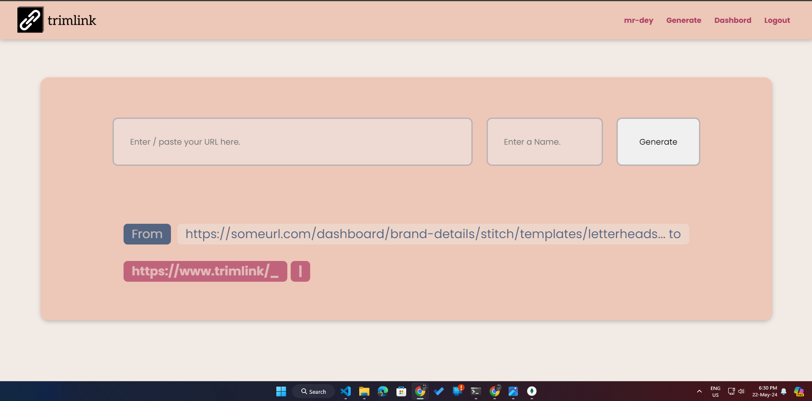

# TrimLink

TrimLink is a URL shortener application that allows users to generate short links for their long URLs. The project includes features such as user authentication, URL analytics, and an easy-to-use interface.

## Features

- **User Authentication**: Secure user login and registration.
- **URL Shortening**: Generate short URLs from long URLs.
- **URL Analytics**: Track the number of clicks on each short URL.
- **Custom URLs**: Generate custom short URLs for easy sharing.


## Technologies Used

- **Frontend**: HTML, CSS, JavaScript, Handlebars (HBS)
- **Backend**: Node.js, Express.js
- **Database**: MongoDB, Mongoose
- **Styling**: CSS, Flexbox

## Installation

1. Clone the repository:
    ```bash
    git clone git@github.com:Mr-Dey/Trim_Link.git
    cd TrimLink
    ```

2. Install dependencies:
    ```bash
    npm install
        "bcrypt": "^5.1.1",
        "express": "^4.19.2",
        "express-session": "^1.18.0",
        "hbs": "^4.2.0",
        "mongoose": "^8.4.0",
        "nodemon": "^3.1.0"
    ```

3. Set up your environment variables. Create a `.env` file in the root directory and add the following:
    ```env
    PORT=3000
    MONGO_URI=your_mongodb_connection_string
    SESSION_SECRET=your_secret_key / secret in this project.
    ```

4. Start the application:
    ```bash
    npm start
    ```

5. Open your browser and navigate to `http://localhost:3000`.

## Usage

1. **Register** for a new account or **login** with your existing account.
2. **Submit** a long URL to generate a short URL.
3. **Share** the short URL with others.
4. **Track** the analytics of your short URL from your dashboard.

## Folder Structure

- `controllers/`: Contains the logic for handling requests and business logic.
- `models/`: Defines the Mongoose schemas and models for MongoDB.
- `routes/`: Defines the application routes.
- `views/`: Contains the Handlebars templates for the frontend.
- `public/`: Contains static files such as CSS, JS, and images.

## Example Usage

To create a short URL:
1. Go to the dashboard.
2. Enter the long URL in the input field.
3. Click the "Generate" button.
4. The short URL will be displayed and saved to your account.

## Mobile view


## Desktop view





## License

This project is licensed under the MIT License. See the [LICENSE](LICENSE) file for details.

## Contributions

Contributions are welcome! Please submit a pull request or open an issue to discuss your ideas.

## Contact

For any inquiries or questions, please contact [me](mailto:subhasishdey619@gmail.com).


